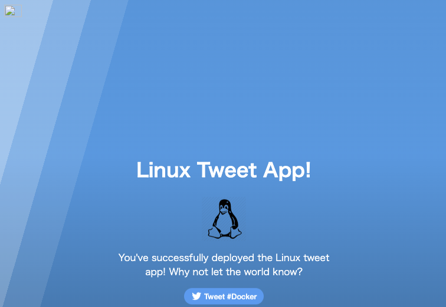

# コンテナ開発

コンテナはマニフェストで詳細を記述します。

マニフェストは Dockerfile、または Containerfile と呼びます。
どちらを使っても構いません。ただ、DockerfileはDocker用のマニフェスト、という意思を感じてしまうため、敢えて「Containerfile」としています。
同義だと思っていいです。

Googleなどで検索する際は「Containerfile」または「Dockerfile」のそれぞれで検索してOKです。

作業用フォルダ work を作成し、移動します。
```sh
mkdir work
cd work
```

## HelloWorld
HelloWorldと出力するアプリ **hw** を作成します。でもただ文字を出してもつまらないので、少しひねった内容にします。

### Containerfileの作成
これからアプリを複数作るので、hwフォルダを用意します。
その中に"Hello World"と書かれた messagefile と、 Containerfile を作成します。
```sh
mkdir hw
cd hw
echo "Hello World" > messagefile
vi Containerfile
```

vi エディタで Containerfileを開いたら、以下を記載します。
```Dockerfile
FROM fedora
RUN yum -y update && yum -y install figlet
ADD ./messagefile /messagefile
CMD cat /messagefile | figlet
```

Containerfileは、コマンドを1行づつ記載します。
それぞれ意味を説明します。

| コマンド | 説明 |
| ---- | ---- |
| FROM | ベースイメージを指定して取得します。ここでは、[fedora](https://hub.docker.com/_/fedora) というLinuxディストリビューションの1つをベースのイメージとして指定しています。Containerfileは大抵このコマンドから始めます。  |
| RUN |  指定したコマンドを実行します。ここでは、yumコマンドを使ってパッケージ情報の更新と figlet をインストールしています。  |
| ADD | ファイルをコンテナ内へコピーします。今回は、messagefileというファイルを、コンテナにコピーしています。 |
| CMD | コンテナを起動した際に実行されるコマンドを指定します。Containerfileの最後の方に記述するこ多いです。ここではmessagefileの中身("Hello World")を figlet コマンドに入力として与えています。figletコマンドは文字列をアスキーバナーに変換して出力します。 |


### ビルド実行
Containerfileからコンテナイメージをビルド・生成します。 buildコマンドを使います。<br/>
ここで、最後の **.(ドット)** を抜かさないようにして下さい。これは現在のディレクトリを対象にビルドをする、という意図です。<br/>
また、"-t" は "--tag" の省略形で、指定しているのは、hw がリポジトリ名、 1.0 がtag(およそバージョンと同義)になります。
```sh
podman build -t hw:1.0 .
```

<details>
<summary>実行例 (yumによるインストールがほとんど)</summary>

```sh
STEP 1/4: FROM fedora
STEP 2/4: RUN yum -y update && yum -y install figlet
Fedora 38 - x86_64                              3.0 MB/s |  66 MB     00:21
Fedora 38 openh264 (From Cisco) - x86_64        1.4 kB/s | 2.5 kB     00:01
Fedora Modular 38 - x86_64                      1.4 MB/s | 2.3 MB     00:01
Fedora 38 - x86_64 - Updates                    2.9 MB/s | 7.1 MB     00:02
Fedora Modular 38 - x86_64 - Updates            388  B/s | 257  B     00:00
Last metadata expiration check: 0:00:01 ago on Sun Apr 16 07:01:24 2023.
Dependencies resolved.
================================================================================
 Package             Architecture  Version                 Repository      Size
================================================================================
Upgrading:
 libgcrypt           x86_64        1.10.2-1.fc38           updates        514 k
 libgpg-error        x86_64        1.47-1.fc38             updates        230 k
 python3             x86_64        3.11.3-1.fc38           updates         28 k
 python3-libs        x86_64        3.11.3-1.fc38           updates        9.6 M
 rpm-sequoia         x86_64        1.4.0-1.fc38            updates        851 k

Transaction Summary
================================================================================
Upgrade  5 Packages

Total download size: 11 M
Downloading Packages:
(1/5): python3-3.11.3-1.fc38.x86_64.rpm          96 kB/s |  28 kB     00:00
(2/5): libgpg-error-1.47-1.fc38.x86_64.rpm      676 kB/s | 230 kB     00:00
(3/5): libgcrypt-1.10.2-1.fc38.x86_64.rpm       1.3 MB/s | 514 kB     00:00
(4/5): rpm-sequoia-1.4.0-1.fc38.x86_64.rpm      1.9 MB/s | 851 kB     00:00
(5/5): python3-libs-3.11.3-1.fc38.x86_64.rpm    4.7 MB/s | 9.6 MB     00:02
--------------------------------------------------------------------------------
Total                                           3.8 MB/s |  11 MB     00:02
Running transaction check
Transaction check succeeded.
Running transaction test
Transaction test succeeded.
Running transaction
  Preparing        :                                                        1/1
  Upgrading        : python3-libs-3.11.3-1.fc38.x86_64                     1/10
  Upgrading        : python3-3.11.3-1.fc38.x86_64                          2/10
  Upgrading        : libgpg-error-1.47-1.fc38.x86_64                       3/10
  Upgrading        : libgcrypt-1.10.2-1.fc38.x86_64                        4/10
  Upgrading        : rpm-sequoia-1.4.0-1.fc38.x86_64                       5/10
  Cleanup          : python3-3.11.2-1.fc38.x86_64                          6/10
  Cleanup          : libgcrypt-1.10.1-7.fc38.x86_64                        7/10
  Cleanup          : libgpg-error-1.46-2.fc38.x86_64                       8/10
  Cleanup          : python3-libs-3.11.2-1.fc38.x86_64                     9/10
  Cleanup          : rpm-sequoia-1.3.0-1.fc38.x86_64                      10/10
  Running scriptlet: rpm-sequoia-1.3.0-1.fc38.x86_64                      10/10
  Verifying        : libgcrypt-1.10.2-1.fc38.x86_64                        1/10
  Verifying        : libgcrypt-1.10.1-7.fc38.x86_64                        2/10
  Verifying        : libgpg-error-1.47-1.fc38.x86_64                       3/10
  Verifying        : libgpg-error-1.46-2.fc38.x86_64                       4/10
  Verifying        : python3-3.11.3-1.fc38.x86_64                          5/10
  Verifying        : python3-3.11.2-1.fc38.x86_64                          6/10
  Verifying        : python3-libs-3.11.3-1.fc38.x86_64                     7/10
  Verifying        : python3-libs-3.11.2-1.fc38.x86_64                     8/10
  Verifying        : rpm-sequoia-1.4.0-1.fc38.x86_64                       9/10
  Verifying        : rpm-sequoia-1.3.0-1.fc38.x86_64                      10/10

Upgraded:
  libgcrypt-1.10.2-1.fc38.x86_64        libgpg-error-1.47-1.fc38.x86_64
  python3-3.11.3-1.fc38.x86_64          python3-libs-3.11.3-1.fc38.x86_64
  rpm-sequoia-1.4.0-1.fc38.x86_64

Complete!
Last metadata expiration check: 0:00:12 ago on Sun Apr 16 07:01:24 2023.
Dependencies resolved.
================================================================================
 Package    Arch       Version                                 Repository  Size
================================================================================
Installing:
 figlet     x86_64     2.2.5-25.20151018gita565ae1.fc38        fedora     137 k

Transaction Summary
================================================================================
Install  1 Package

Total download size: 137 k
Installed size: 666 k
Downloading Packages:
figlet-2.2.5-25.20151018gita565ae1.fc38.x86_64. 1.2 MB/s | 137 kB     00:00
--------------------------------------------------------------------------------
Total                                           193 kB/s | 137 kB     00:00
Running transaction check
Transaction check succeeded.
Running transaction test
Transaction test succeeded.
Running transaction
  Preparing        :                                                        1/1
  Installing       : figlet-2.2.5-25.20151018gita565ae1.fc38.x86_64         1/1
  Running scriptlet: figlet-2.2.5-25.20151018gita565ae1.fc38.x86_64         1/1
  Verifying        : figlet-2.2.5-25.20151018gita565ae1.fc38.x86_64         1/1

Installed:
  figlet-2.2.5-25.20151018gita565ae1.fc38.x86_64

Complete!
--> Pushing cache []:b5be31b75a7b031ee291e82907b39c9103ca848683d349aaef5c9e28ad94388b
--> 70ea8b96d07
STEP 3/4: ADD ./messagefile /messagefile
--> Pushing cache []:10ab90b4d35516f71a092ba0348367d3f0a1e5194fc36b5b321aeab8ba0202b0
--> 08d3196efe3
STEP 4/4: CMD cat /messagefile | figlet
COMMIT
--> Pushing cache []:08354a00bfa748c1dad8d8833f91c75f3a6ccefb370df730735711ecb461e1dd
--> 016f667375a
016f667375a74fb752d4f929f08b6b5a90ca319b178d4fca693fba152fde84e0
```
</details>

作成したコンテナイメージを確認します。
```sh
podman images
```

<details open>
<summary>実行例</summary>
  
```
$ podman images
REPOSITORY                         TAG         IMAGE ID      CREATED     SIZE
registry.fedoraproject.org/fedora  latest      c9bfca6d0ac2  3 days ago  196 MB
localhost/hw                       1.0         016f667375a7  6 days ago  437 MB
```
</details>

localhostにhwというコンテナが、TAG1.0で作成されているのを確認できました。

では、早速実行してみましょう。

```
podman run hw:1.0
```

<details>
<summary>実行例</summary>
  
```
$ podman run hw:1.0
 _   _      _ _        __        __         _       _
| | | | ___| | | ___   \ \      / /__  _ __| | ____| |
| |_| |/ _ \ | |/ _ \   \ \ /\ / / _ \| '__| |/ / _` |
|  _  |  __/ | | (_) |   \ V  V / (_) | |  |   < (_| |
|_| |_|\___|_|_|\___/     \_/\_/ \___/|_|  |_|\_\__,_|


```
</details>

Hello Worldのアスキーバナーが表示されましたね。<br/>
コンテナの開発に成功しました！

ここで、各自5分～10分程度使って、以下のような内容を試してみましょう。
* messagefileの中身を好きな言葉にして再度ビルド・実行し、その結果を楽しみましょう
* TAGを1.0から1.1や1.2にして、`podman images`の結果を確認してみましょう。実行してみましょう。
* `podman ps -a`を実行すると、tag1.0などの古いコンテナが貯まっていますね。コンテナを削除してみましょう。イメージも削除してみましょう。

## 静的Webアプリ

次に、Webサーバ nginx を使って 静的Webアプリ **linux_tweet_app** を配信します。

### ソースコード一式のclone
ソースコードを一から作るのは時間が足りないので、sampleをダウンロードします。
```
git clone https://github.com/dockersamples/linux_tweet_app.git
```

<details>
<summary>実行例</summary>

```
$ git clone https://github.com/dockersamples/linux_tweet_app.git
Cloning into 'linux_tweet_app'...
remote: Enumerating objects: 14, done.
remote: Counting objects: 100% (8/8), done.
remote: Compressing objects: 100% (4/4), done.
remote: Total 14 (delta 4), reused 4 (delta 4), pack-reused 6
Receiving objects: 100% (14/14), 10.79 KiB | 10.79 MiB/s, done.
Resolving deltas: 100% (5/5), done.
```
</details>

### ビルド実行
git clone したソースコードには、静的Webアプリ(html)とDockerfileが含まれています。<br/>
Dockerfileの中身を読んでみます。

| コマンド | 説明 |
| ---- | ---- |
| FROM | ベースイメージを指定して取得します。ここでは、[nginx:latest](https://hub.docker.com/_/nginx) というlinuxにWebサーバアプリケーションnginxが配置されたコンテナイメージをベースのイメージとして指定しています。 |
| COPY | ファイルをコンテナ内へコピーします。ここでは、index.htmlというファイルを、コンテナの /usr/share/nginx/html にコピーしています。 |
| COPY | ファイルをコンテナ内へコピーします。ここでは、linux.pngというファイルを、コンテナの /usr/share/nginx/html にコピーしています。 |
| EXPOSE | 指定したポートをLISTEN状態とします。ここでは80(HTTP)と443(HTTPS)をLISTEN状態にしています。 |
| CMD | コンテナを起動した際に実行されるコマンドを指定します。ここでは nginx を起動しています。 |

COPY と ADD は同じようなコマンドですが、以下の違いがあります。
* COPY - 明示的なコピー元とコピー先のファイルまたはディレクトリを指定して、ローカルファイルを再帰的にコピーします。 COPYでは、場所を宣言する必要があります。
* ADD - ローカルファイルを再帰的にコピーし、存在しない場合は暗黙的にコピー先ディレクトリを作成し、アーカイブをコピー元としてローカルURLまたはリモートURLとして受け入れます。アーカイブはそれぞれコピー先ディレクトリに展開またはダウンロードされます。


では、 **linux_tweet_app** という名前のコンテナとしてビルドします。
```
cd linux_tweet_app
podman build -t linux_tweet_app .
```

<details>
<summary>実行例</summary>
  
```
STEP 1/5: FROM nginx:latest
Resolving "nginx" using unqualified-search registries (/etc/containers/registries.conf.d/999-podman-machine.conf)
Trying to pull docker.io/library/nginx:latest...
Getting image source signatures
Copying blob sha256:4b98867cde79486d55399cb95957331018b849a2bf04ee9a6dcae9b8bc482d76
Copying blob sha256:5b5fe70539cd6989aa19f25826309f9715a9489cf1c057982d6a84c1ad8975c7
Copying blob sha256:441a1b46536703aec84bf2cabdd2524d4cc7dad9c6772491e01ff8ffe15b5507
Copying blob sha256:3b9543f2b5005b74aae0ffaa779803f2b162ec3bd461c9e10a21671512718c87
Copying blob sha256:ca89ed5461a9f2c681ebd39ed6583a7405d82f51b42177b7388c99eb6869e780
Copying blob sha256:b0e1283145af839c63923f671b4ab6c5d9e22826ab4372c6660db5a5556446c8
Copying blob sha256:4a85ce26214d83c77b5464631a67c71e1c2793b655261befe52ba0e20ffc3bd1
Copying config sha256:eb4a57159180767450cb8426e6367f11b999653d8f185b5e3b78a9ca30c2c31d
Writing manifest to image destination
Storing signatures
STEP 2/5: COPY index.html /usr/share/nginx/html
--> fa46eba0ae60
STEP 3/5: COPY linux.png /usr/share/nginx/html
--> ee76d79be354
STEP 4/5: EXPOSE 80 443
--> c369df24005a
STEP 5/5: CMD ["nginx", "-g", "daemon off;"]
COMMIT linux_tweet_app
--> f78b0d7e4b55
Successfully tagged localhost/linux_tweet_app:latest
f78b0d7e4b55790eb89d8a47fe3361ad96493991472f5f2a53d3ffe55565f2e7
```
</details>

作成されたコンテナイメージを確認します。
```
podman images
```

<details>
<summary>実行例</summary>

```
REPOSITORY                                   TAG         IMAGE ID      CREATED            SIZE
localhost/linux_tweet_app                    latest      f78b0d7e4b55  8 seconds ago      191 MB
```
</details>

コンテナイメージを実行します。 **-p** でhttp(80)をホストネットワークの8081ポートにバインドします。**-d**でバックグラウンド実行させます。
```
podman run -d -p 8081:80 linux_tweet_app
```
ブラウザで http://localhost:8081 を開き、以下のようなサイトが表示されれば成功です。



## Python Webアプリケーションのコンテナ化

### Python アプリの作成 (コンテナ は使用しません)

PythonのWebアプリを作成します。PythonにはWebアプリを作成するための様々なライブラリ・フレームワークが存在しますが、今回は Flask というシンプルなWebフレームワークを使います。

app.pyというファイルを作成し、以下のコードをコピーして下さい。

```python
from flask import Flask

app = Flask(__name__)

@app.route("/")
def hello():
    return "Hello World!"

if __name__ == "__main__":
    app.run(host='0.0.0.0', port=5000)
```

```sh
$ python3 app.py 
 * Running on http://0.0.0.0:5000/ (Press CTRL+C to quit)
```

### ビルドと実行

Python がローカルにインストールされていなくても心配しないでください！Python がインストールされていなくても、Python アプリを実行することはできます。Docker コンテナを使用する利点の 1 つは、Python をコンテナに組み込めることです。したがって、Python がホスト上にインストールされている必要はありません。 

`Containerfile` を作成します。以下のコードを貼り付けて下さい。

```Dockerfile
FROM python:3.11-alpine3.18
RUN pip install flask
CMD ["python","app.py"]
COPY app.py /app.py
```

内容はこれまでと変わりませんので、説明は簡単にします。
ベースイメージは alpineというlinuxにpythonが導入されたイメージを使います。
flaskライブラリを導入し、flaskを実行します。

```sh
podman build -t python-hello-world .
```

<details>
<summary>実行例</summary>
```sh
STEP 1/4: FROM python:3.11-alpine3.18
STEP 2/4: RUN pip install flask
Collecting flask
  Downloading Flask-2.3.2-py3-none-any.whl (96 kB)
     ━━━━━━━━━━━━━━━━━━━━━━━━━━━━━━━━━━━━━━━ 96.9/96.9 kB 727.9 kB/s eta 0:00:00
Collecting Werkzeug>=2.3.3 (from flask)
  Downloading Werkzeug-2.3.6-py3-none-any.whl (242 kB)
     ━━━━━━━━━━━━━━━━━━━━━━━━━━━━━━━━━━━━━ 242.5/242.5 kB 902.1 kB/s eta 0:00:00
Collecting Jinja2>=3.1.2 (from flask)
  Downloading Jinja2-3.1.2-py3-none-any.whl (133 kB)
     ━━━━━━━━━━━━━━━━━━━━━━━━━━━━━━━━━━━━━━━ 133.1/133.1 kB 1.2 MB/s eta 0:00:00
Collecting itsdangerous>=2.1.2 (from flask)
  Downloading itsdangerous-2.1.2-py3-none-any.whl (15 kB)
Collecting click>=8.1.3 (from flask)
  Downloading click-8.1.3-py3-none-any.whl (96 kB)
     ━━━━━━━━━━━━━━━━━━━━━━━━━━━━━━━━━━━━━━━ 96.6/96.6 kB 916.8 kB/s eta 0:00:00
Collecting blinker>=1.6.2 (from flask)
  Downloading blinker-1.6.2-py3-none-any.whl (13 kB)
Collecting MarkupSafe>=2.0 (from Jinja2>=3.1.2->flask)
  Downloading MarkupSafe-2.1.3-cp311-cp311-musllinux_1_1_x86_64.whl (33 kB)
Installing collected packages: MarkupSafe, itsdangerous, click, blinker, Werkzeug, Jinja2, flask
Successfully installed Jinja2-3.1.2 MarkupSafe-2.1.3 Werkzeug-2.3.6 blinker-1.6.2 click-8.1.3 flask-2.3.2 itsdangerous-2.1.2
WARNING: Running pip as the 'root' user can result in broken permissions and conflicting behaviour with the system package manager. It is recommended to use a virtual environment instead: https://pip.pypa.io/warnings/venv
--> cb754fd91d35
STEP 3/4: CMD ["python","app.py"]
--> d4eb23236adc
STEP 4/4: COPY app.py /app.py
COMMIT python-hello-world
--> 6115bed64482
Successfully tagged localhost/python-hello-world:latest
6115bed6448297625ed1426c6e0f85907bad553c8550d7a637f959434fd4327c
```
</details>

`podman images` を実行し、コンテナイメージがあることを確認します。
```sh
podman images
```

<details open>
<summary>実行例</summary>
  
```sh
$ podman images
REPOSITORY                                   TAG              IMAGE ID      CREATED        SIZE
localhost/python-hello-world                 latest           6115bed64482  3 minutes ago  72.2 MB
```
</details>

イメージのビルドが完了したら、そのイメージを実行して機能するかどうかを確認します。

```sh
podman run -p 5001:5000 -d python-hello-world
```

ブラウザー内で http://localhost:5001 にアクセスして、結果を確認します。 
ブラウザー上に「hello world!」と表示されるはずです。

次に、コンテナのログ出力を確認しましょう。

アプリケーションからログを確認する場合は、`podman logs` コマンドを使用できます。デフォルトでは、`podman logs` はアプリケーションが送信した内容を標準出力に出力します。実行中のコンテナの ID は、`podman ps` を使用して確認できます。

```sh
$ podman ps
CONTAINER ID  IMAGE                                COMMAND        CREATED         STATUS         PORTS                   NAMES
d63564fb5890  localhost/python-hello-world:latest  python app.py  33 seconds ago  Up 33 seconds  0.0.0.0:5001->5000/tcp  awesome_ardinghelli
$ podman logs d63564fb5890
 * Serving Flask app 'app'
 * Debug mode: off
WARNING: This is a development server. Do not use it in a production deployment. Use a production WSGI server instead.
 * Running on all addresses (0.0.0.0)
 * Running on http://127.0.0.1:5000
 * Running on http://10.88.0.16:5000
Press CTRL+C to quit
10.88.0.16 - - [01/Jun/2023 06:18:08] "GET / HTTP/1.1" 200 -
```

以上でコンテナ開発の第一歩は完了です。
このPython Webアプリは続けて次のコンテンツでも使います！

## (余裕のある人向け) Spring Boot (Java) アプリケーションのコンテナ化

注) このコンテンツはビルドや実行ごとに数分待ちが発生します。時間が余っている人だけ実施下さい。

最後に、Webサーバ nginx を使って Spring Boot Java Webアプリ **petclinic-app** を配信します。

### ソースコード一式のclone
ソースコードを一から作るのは無理なので、ソースコードをダウンロードします。
```sh
git clone https://github.com/dockersamples/spring-petclinic-docker.git
```

### ビルド実行
git clone したソースコードには、JavaアプリケーションとDockerfileが含まれています。<br/>
Dockerfileの中身を読んでみます。

| コマンド | 説明 |
| ---- | ---- |
| FROM | ベースイメージを指定して取得します。ここでは、eclipse-temurin:17-jdk-jammy というspring bootアプリケーションのベースイメージを指定しています。 |
| WORKDIR | 作業ディレクトリを変更します。 linux/windowsのcdと同義です |
| COPY | ファイルをコンテナ内へコピーします。 |
| RUN | コマンドを実行します。 |
| CMD | コンテナを起動した際に実行されるコマンドを指定します。ここでspring bootを起動しています |


では、 **petclinic-app** という名前のコンテナとしてビルドします。
```sh
cd spring-petclinic-docker
podman build -t petclinic-app . -f Dockerfile
```
出力は非常に長いので省略しますが、最後に"Successfully ....." という文言があればビルドは成功です。

ビルドが完了したので、実行します。ここでもビルドと同じようにmvnによるダウンロードが行われるため、大量の時間がかかります。<br/>
バックグラウンドだといつ終わったかわからないので、フォアグラウンドで実施します。

```sh
podman run -p 8082:8080 petclinic-app
```

PetClinic のアスキー文字が表示されたら、ほぼ完了です。ブラウザで http://localhost:8082 にアクセスし、アプリケーションが表示されることを確認します。


## 参考
Containerfile/Dockerfileには多くのコマンドがあり、すべては紹介しきれません。より多くのコマンドを知りたい方は、以下をご確認ください。
* Dockerfileリファレンス(日本語翻訳版): https://docs.docker.jp/engine/reference/builder.html
* Containerfileのコマンド説明(チートシート): https://qiita.com/mintak21/items/a6766e3efd6730c9519d
* Docker Sample(Docker doc): https://docs.docker.com/samples/
* Docker Sample(GitHub): https://github.com/dockersamples
