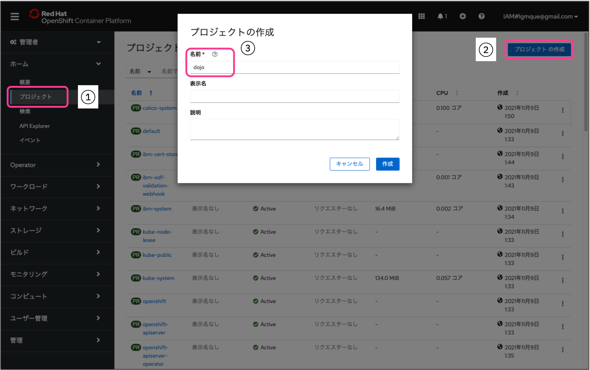
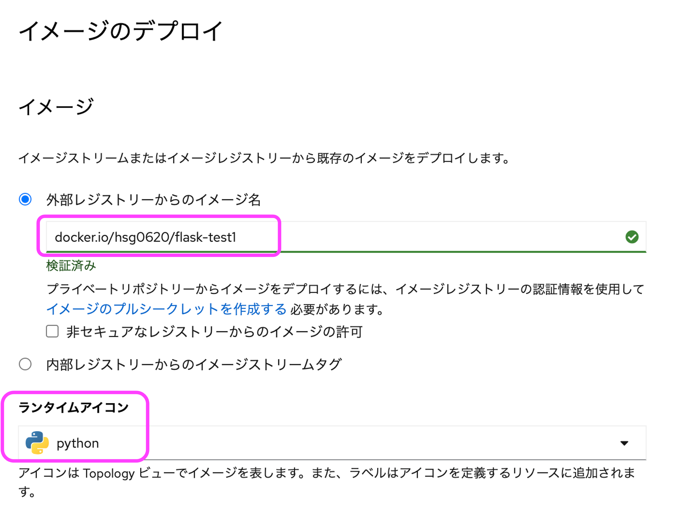
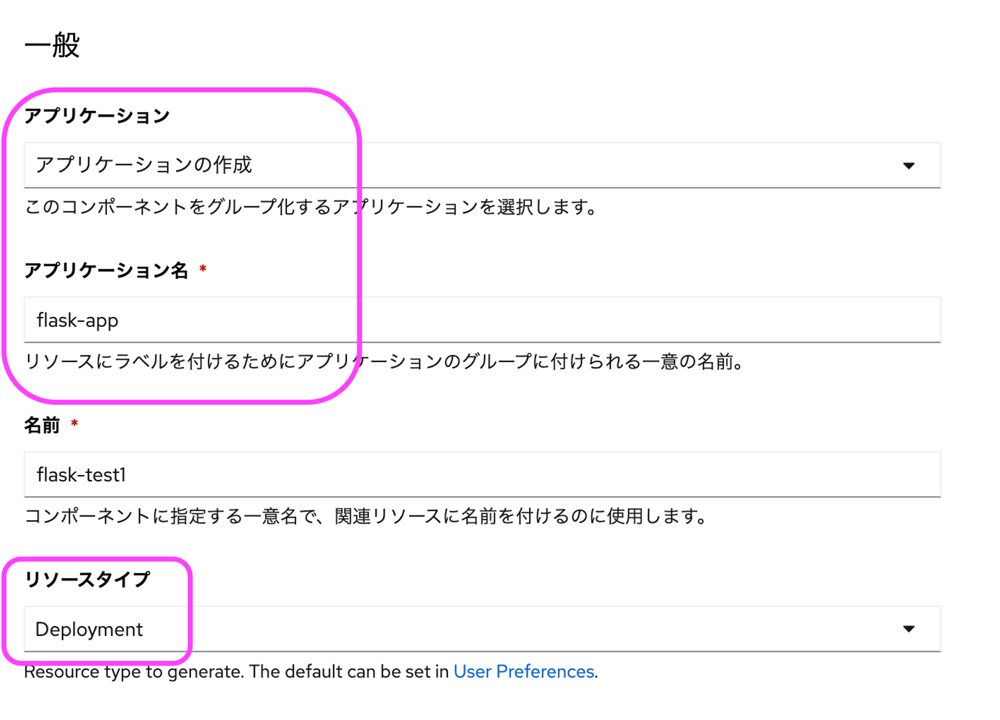
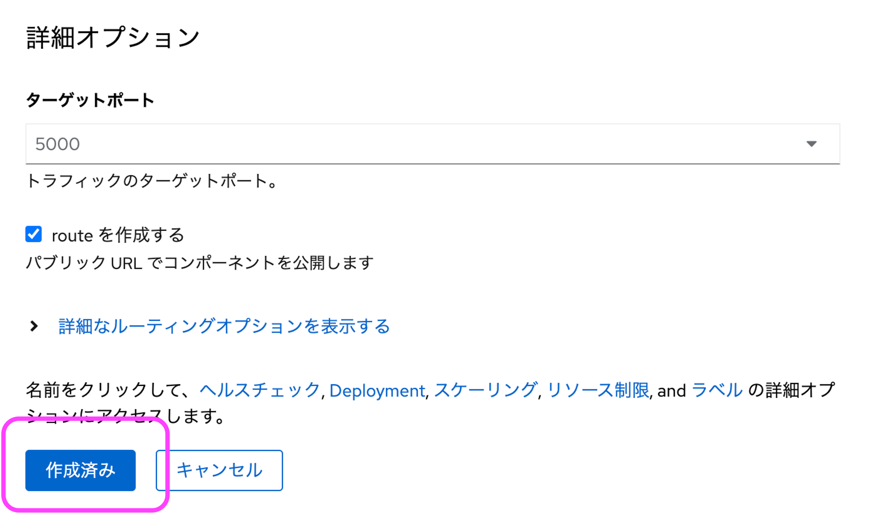
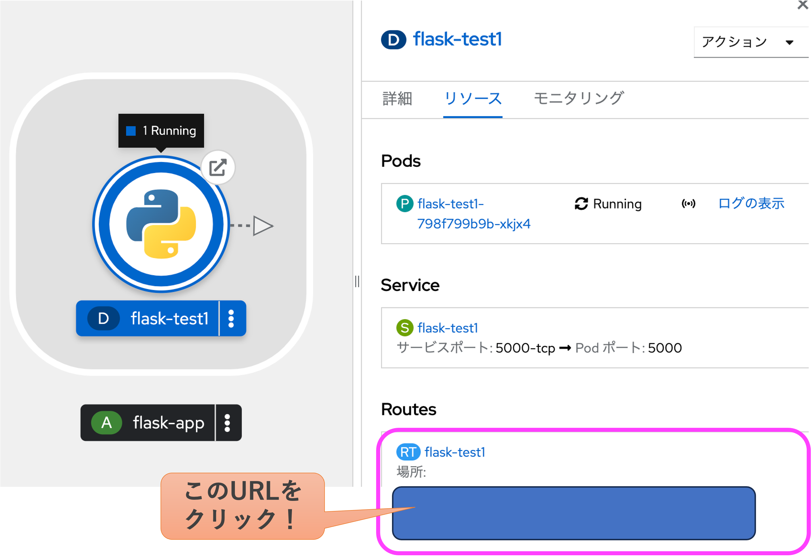

# OpenShiftへのデプロイ

最後に、コンテナイメージをOpenShiftにデプロイしてみましょう。
皆様の環境のOpenShiftにログインしてください。

もしOpenShiftの環境をお持ちではない方は、[Red Hat Developer Sandbox](https://developers.redhat.com/developer-sandbox) または OpenShift Local をお試しください。
どちらも Red Hatアカウントの作成が必須となりますが、無料で利用可能です。

## プロジェクトの作成

**注意) Red Hat Developer Sandboxをお使いの方は、プロジェクト作成権限が与えられていません。この作業は飛ばして、提供済みのプロジェクトを利用して下さい。**

OpenShiftのWebコンソールにて「管理者」パースペクティブを選択し、プロジェクトをクリックします。 
「プロジェクトの作成」ボタンをクリックするとプロジェクトの作成画面が開きますので、お好きなプロジェクト名を入力し、作成ボタンをクリックして下さい。(名前は英数小文字で)

補足) プロジェクトとは、OpenShiftを複数の案件で分けて使いたい、という時に論理的に分ける仕組みです。案件ごとにプロジェクトを分けるケースが多いです。Kubernetesではnamespaceといいます。(OpenShiftでもnamespaceという時があります)

## コンテナイメージのデプロイ

「開発者」パースペクティブに変更し、「+追加」をクリックします。 
画面右側の「コンテナイメージ」をクリックします。

「外部レジストリーからのイメージ名」には先ほどDocker Hubにpushしたイメージを指定します。 
`docker.io/<username>/<reponame>` です。

ランタイムアイコンは好みですが、`python`を選択します。

アプリケーションは「アプリケーションの作成」を選択します。アプリケーション名は好きな名前をつけて下さい。(管理上の名前なので、なんでも構いません) 
リソースタイプは `Deployment` を選択します。あとはデフォルトのままでOKです。

作成済みをクリックします。

トポロジ画面にデプロイされたアプリケーションが表示されます。 
色がデプロイ状況を示しており、水色がデプロイ中、青が稼働中、赤が障害発生中、となります。

色が青になりましたら、リソースタブの一番下側にある`Routes`のHTTP URLをクリックして下さい。

恐ろしくシンプルですが、ブラウザで以下の表示がされたらデプロイは成功です。

以上でOpenShiftへのデプロイは完了です。お疲れ様でした！
