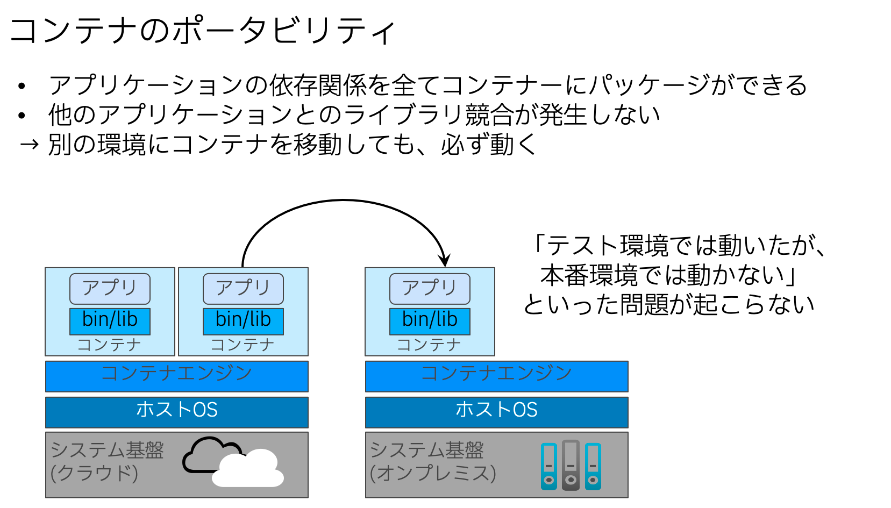

# container101

**Podman を使ったコンテナ操作〜作成、OpenShiftへのデプロイまで**

本コンテンツは これからコンテナを学ぶ人向けのハンズオンコンテンツです。

## コンテナとは

コンテナとは仮想化技術の1つで、**OSの仮想化**です。 
OSの仮想化と言ってもピンとこないかと思います。 
まずは、仮想化技術の歴史をざっくり振り返りつつ、OSの仮想化について説明していきます。

一番左が **仮想化なし** のシンプルな物理サーバです。 
HWの上にOS、その上に、アプリを載せるというシンプルな構成です。この構成の場合、何かしらの理由でサーバの負荷が高まってしまった場合、新しいサービスを提供したくなった場合などには、サーバの台数を増やさなければなりません。 
台数が増えることで、サーバの管理工数や電気代の増加、物理的なスペースの確保が必要など、様々な問題が出てきてしまいます。

そこで広く広まったのが、中央の仮想化技術です。 
言い換えると **HW仮想化** とも言えます。物理マシンを仮想的に「集約」することで、省エネ、省スペースを実現し、コスト削減を図れる、ということで、この技術が広まりました。 
仮想化技術といえば、ホスト型、ハイパーバイザー型の２種類がありますが、この図ではハイパーバイザー型仮想化をご紹介しています。 
ハイパーバイザー型仮想化は、HW にハイパーバイザーという仮想化ソフトウェアを入れて、その上で仮想マシンを動かす技術です。 
仮想マシンには各々ゲストOSが存在しています。VMware ESXi,、Microsoft Hyper-V、 Xenなどが有名です。

そして次が一番右のコンテナです。 
例えば、皆さんが何か新しいサービスをローンチしたいなとという時のことを想像してみてください。 
開発環境でコーディングされ、テスト環境で動作確認され、ステージング環境にデプロイされ、本番環境でサービス提供をおこない、、、、そんなプロセスを踏むと思います。 
先述のすべての環境の整備とアプリケーションデプロイが必要です。 
アプリケーションを正しく動かすには、環境間で、OSを揃えたり、実行環境のバージョンを揃えたりと、いろいろな作業が必要になり、なかなか面倒になってしまいます。 
そこでアプリケーションを動作OS（ホストOS）や環境依存から隔離させてしえばいい考えが生まれました。これを **OS仮想化** と呼びます。 
コンテナ仮想化はOS仮想化の一種で、カーネルをホストと共有し、ソースコードとバイナリ、ライブラリなどの依存関係をひとまとめにパッケージングしてしまうことで、実行環境に依存しない、独立した環境を作るそんな概念になっています。

## ハイパーバイザー仮想化(VM)とコンテナの違い

ハイパーバイザー仮想化(VM)とコンテナの違いをもう少し詳しくみていきます。 
まず、仮想マシンはハードウェアをエミュレートしており、仮想マシンごとにそれぞれ別のOSが存在します。

コンテナはOSを仮想化しますので、一つのOSを共用します。 
そのため、コンテナはコンテナ間で依存関係はありませんが、下回りのOSやHWにいくらか依存する点は注意が必要です。 
OSから隔離して、OS依存を無くすのが、OS仮想化だとお伝えしましたが、完全に依存が0になるわけではない点はご注意ください。

例えば、いくらコンテナを使ったとしても、Linuxサーバ上では、Linuxコンテナしか動かせませんし、Windows Serverの上ではWindowsコンテナしか動かすことはできません。

仮想マシンは、ゲストOSとアプリケーションという構成で、コンテナはホストOSはを共用し、アプリケーションとlib/binなどの依存関係を一つの塊とすることで、環境依存の低減をはかっています。 
仮想マシンの場合は、マシンごとにOSを含みますので、異なるOSを独立して選択可能です。 
コンテナの場合は、OSを含まない分、軽量で起動がはやい、そして、ライブラリごとパッケージングしてしまうので、アプリ間の競合が発生しないという特徴があります。

## コンテナのポータビリティ

コンテナのメリットの１つとしてポータビリティに優れている点が挙げられます。可搬性に優れる、という言い方をすることもありますが、同じ意味です。 
コンテナエンジンがあれば、別の環境にコンテナを移動させても、大体の場合、動くというメリットがあります。 
ただし、先ほどもお伝えした通り、いくらコンテナと言ってもOSやHW依存の部分があるので、そこは注意する必要があります。 
そこさえ気をつければ、開発環境、本番環境あって、バージョンが実は違いました。開発環境では上手く動いたけど、本番環境では上手く動かない、そんなトラブルを未然に防ぐことができます。

## コンテナの特徴

次にコンテナの特徴、注意すべき点をお伝えします。

コンテナは、1コンテナ=1プロセスというべストプラクティスがあります。システムを密結合させないことで問題を局所化するという考え方に基づいたものです。

例えばVMの場合、ログインとしてpsコマンド実行すると、プロセスがずらずらと出てくることは普通です。思想がVMとは異なるということをご理解下さい。

そして、基本的にデータは揮発性です。データ共有や引継ぎを行いたい場合は、永続ボリュームという機構を用いてデータの永続化を行うことができます。

この揮発性、という機構が裏を返せば、削除作成を気軽にくり返すことができるといえます。

## コンテナプラットフォーム

コンテナを実行・ビルドするためのプラットフォームとしては、**Docker** が圧倒的に有名です。 
Docker Desktop自体は 2021年に条件付きで有償化されています。一般企業が商用利用する場合に無償で利用することは難しいと考えて良いでしょう。 
ただ、Docker CLI(コマンド) 自体は無償で利用可能です。そちらのみを利用いただくでも問題ありません。

Red Hatは コンテナプラットフォームとして Podman を採用しています。 
詳細は、[Red Hat がPodmanに移行した背景](https://qiita.com/caunu-s/items/4fa0e0465ea83fcc06e4) を参照いただくとして、Red Hat系ディストリビューションを採用する場合は、Podman を利用するのが最もスマートです。 
podman コマンドは docker コマンドとほぼ互換があります。 podman ≒ docker と考えて差し支えありません。

## ハンズオン
ここまで、コンテナについてざっくりと説明させていただきました。

ここからは、早速ハンズオンを始めましょう。
ハンズオンコンテンツは別のMarkdownファイルとして作成しています。まずは [101 コンテナ操作方法の理解](./101-How_to_use_container.md) から始めていきましょう。
